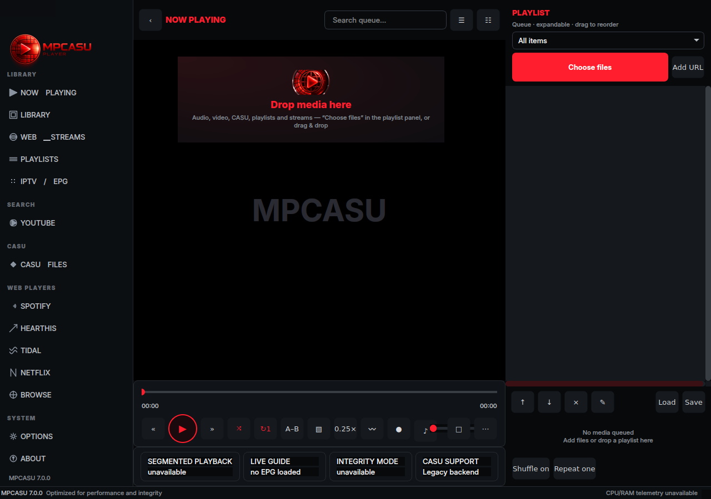
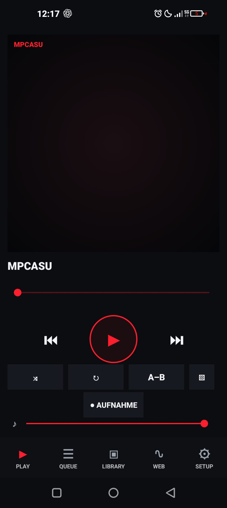

# MPCASU Player

> Deutsch / Italiano / English: [Disclaimer zur Weitergabe älterer CASU-Versionen](DISCLAIMER.md)

Cross-platform media player with experimental segmented-media playback support.

MPCASU Player is available for Linux, Windows, macOS, Android and iOS. The
desktop application uses Qt; Android and iOS use native mobile interfaces.
It provides audio and video playback, queues, a grouped Tracks / Artists /
Albums / Genres library, playlists, YouTube video and playlist search,
streams, IPTV/EPG support where available, recording with configurable split
modes, subtitles, chapters, bookmarks and a lightweight Wave visualizer.

## Downloads

Use the `v7.0.0` release. `SHA256SUMS` covers only the public player packages.

- Linux: `mpcasu-player_7.0.0_all.deb`
- Windows: portable ZIP or player-only installer
- macOS: player-only DMG
- Android: APK
- iOS: unsigned IPA; user-side signing is required before installation

The iOS package is not App Store signed. A compatible Apple development or
self-signing route is required, and free provisioning may expire.

## About CASU and why the full codec toolchain is not included

CASU grew out of experiments with segmented-state media representation.
Rather than treating video only as a sequence of completely refreshed global
image states, the research explores persistent visual state together with
localized temporal changes. The work examines segmented representation, local
state changes, playback efficiency, resource use and perceptual playback
behavior. Any health or perception benefit remains an unproven hypothesis
that would require proper measurement and research.

MPCASU retains read-only playback support for this experimental media family.
The complete CASU creation and conversion toolchain is intentionally not part
of this public repository or its releases. A new media representation may
initially be unknown to existing forensic, moderation, indexing and
media-analysis systems. We therefore want to evaluate recognition and
interoperability implications with appropriate technical and legal expertise
before distributing the complete creation toolchain more broadly.

CASU was not created for concealment or evasion. The codec project is not
abandoned; its broader publication model is under review.

## Privacy and telemetry

MPCASU does not contain hidden telemetry, honeypot behavior, deanonymization,
silent reporting or telemetry intended to identify users of CASU media. Any
future forensic cooperation is outside this release and would require a
separate lawful design and appropriate organizational authority.

## Source boundary

This repository contains the player applications and their player-facing
code. It does not contain the standalone CASU CLI, converter, packer, repair
tools, encoder, creation UI, research corpora or the private repository's Git
history. Read-only decoder components are included only where required for
playback.

## License

Project-authored MPCASU material in this repository is distributed under
[Anticapitalist License 1.4](LICENSE).

The background and current publication boundary of the experimental CASU
codec are explained in [DISCLAIMER.md](DISCLAIMER.md).

Third-party runtime components retain their respective upstream licenses and
are not relicensed by the MPCASU project. See
[THIRD_PARTY_COMPONENTS.md](THIRD_PARTY_COMPONENTS.md) and
[THIRD_PARTY_LICENSES/](THIRD_PARTY_LICENSES/).
